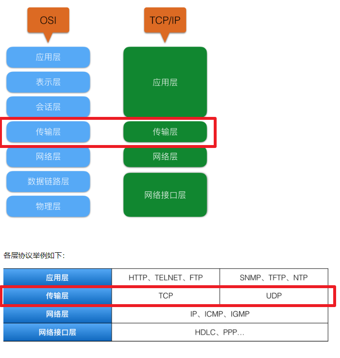
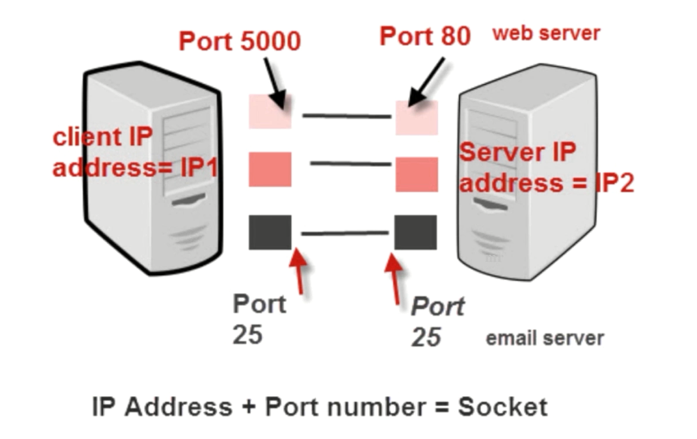
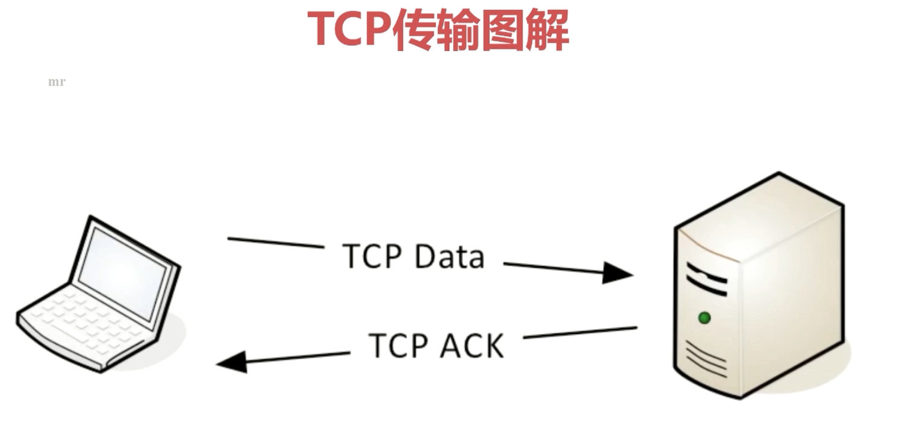
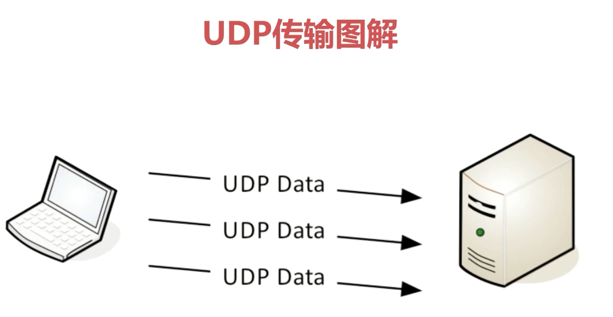

# Socket
> 学习有关网络基础相关的内容

## 第一天

### 为什么要把网络协议进行分层?

**关键字:试想一下,如果需要实现发送快递的所有细节才能发送快递的话,首先发送成本变得非常高昂。其次是错误率也会变得很高。这也是对网络或者很多事物进行分层的一个基础理论。**

我们可以用公司邮寄快递为例,快递邮寄大约分为

1. 将快递交给快递待发点。
2. 快递待发点对快递进行包装。
3. 装车发送快递。
4. 到达目的地卸车。
5. 去除快递包装(广义的理解,不要理解为快递的包装袋子)。
6. 代送点将快递交给客户。

这里面可以说是分为了6层。这样做最大的好出是分工协作。无需了解发快递的所有细节才能发送快递。试想一下,如果需要**实现**发送快递的所有细节才能发送快递的话,首先发送成本变得非常高昂。其次是错误率也会变得很高。这也是对网络或者很多事物进行分层的一个基础理论。

综上我们在进行socket开发的时候只需要

关注传输层就可以了。至于层与层之间的调用,会有一个接口供我们使用,或者接口都会被隐含在代码中。所以我们在开发socket网络应用的时候应该关注传输层就可以了。其他层我们无需理解掌握,甚至我们所学暂时不可能了解清楚,只需要掌握传输层就可以了,也已经是相对很高的标准了!!!

### 网络传输到底是怎么实现的呢?

简单来说吧,网路传输最终都是电信号(高低电压),比如我们要发送一个"你好 世界",会将字符串转换为一个byte字节数据,然后通过物理层将byte数据转换为电信号,进行寻址发送。我们并不需要关注"你"这个字最终转换成什么样的电信号,我们只需要遵守相应的api或协议就行!所以网络传输最终都是电信号的传输。

### Socket是什么

socket其实就是对TCP与UDP的封装。

简单来说socket其实就是IP地址与端口的结合协议。

socket是TCP/IP协议相关api的总称,是网络api的集合。

socket涵盖了Stream Scoket(就是TCP),Datagram Socket(就是UDP)

### Socket的组成与作用

在网络传输中用于,唯一标示,两个端点的连接。比如在A计算机与B计算机之间通过Socket进行连接,这不一定是物理上的连接,因为连接有可能断开。socket并不管物理层面的连接。socket是唯一标示两端点之间的连接。

端点: 包含(IP + Port)

socket作为唯一标示两个端点的连接,主要有四个要素才能唯一标识出两个端点的连接分别为:

1. 客户端地址
2. 客户端端口
3. 服务器地址
4. 服务器端口

### Socket 传输原理

### Socket之TCP

TCP是面向连接的通信协议。

TCP协议通过三次握手简历连接,通讯完成时要拆除连接。

---

类比,

我们找女神聊天,要献祭出屌丝三宝的话,需要先问女神,

在吗?

女神说在呢。

然后我们再说,我跟你说点事啊。

...此处省略30个字...。

此时女神说我要去洗澡了。

我们回复,那你洗完早点睡啊,我走了。

女神回复,赶紧走吧。

屌丝下线。

---

TCP是面向连接的所以说只能用于端到端的通信。(面向连接意味着,只有建立了连接TCP协议才能正常的通信。端到端意味着,我们在某一个时刻只能连接到某一个确定的端口,不能在一次TCP通讯中连接两个端口)

TCP发送数据,只存在成功或是失败两种情况。不存在发送一半这种情况。一条数据传输到服务器上时,首先进行TCP的数据发送。同时会受到一条TCP的回复,代表这条数据受到了。但是TCP ACK这个回复并不是由我们来完成的,而是TCP层面已经完成了回复的封装。

### Socket之UDP

UDP是面向无连接的通讯协议。(无需连接)

UDP的数据包括目的端口号和源端口号的信息。

由于通讯不需要连接,所以可以实现广播发送,并不局限于端到端。

---

栗子:

狗蛋是一个人民教师,现在需要通知放假信息。

如果狗蛋选择TCP协议进行通信的话,就意味着狗蛋需要找到每一个学生,一个一个的告知。这样做的优点是,不会存在某个学生没有通知到的情况。缺点显而易见,太麻烦了,这种场景下,效率太低。

如果够短选择UDP协议进行通信的话,就意味着,狗蛋可以在上课时,一次性告知全班所有的学生放假信息。这样做的优点是,效率很高。但是缺点是有可能存在某个学生不在班上,从而错过收听消息的情况。

---

与TCP发送数据不同,UDP只管将数据发送,不会处理回复,不存在反馈。

### Client-Service Application

TCP/IP协议中,两个进程间通信的主要模式为:CS模型。

CS模型的主要目的是协同网络中的计算机资源,服务模式,进程间的数据共享。